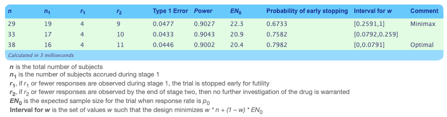

```{r}
library(tidyverse)
library(OptimalDesign)
library(ICAOD)
library(lubridate)
library(janitor)
library(tableone)
```
### Problem 1

```{r}
df <- read.csv("ctg-studies.csv")
df <- df %>% clean_names()
```

Taichi is a traditional Chinese body-mind practice that purports to bolster physical fitness while also cultivating the mind. It has a low bar to entry as it doesn't require special clothing or equipment, and can be practice with limited space and time. Therefore, it is a practical and adaptable exercise choice that if effective, can be a widely accessible intervention or therapy. 

We can use the clinicaltrials.gov website to get an idea of how Taichi has been used in the health sciences as an intervention. To do so, I started by searching "("tai chi" OR "tai-chi" OR "taichi" OR "tai ji" OR "taiji" OR "tai ji quan" OR "taijiquan" OR "t'ai chi") AND AREA[StudyType]EXPANSION[None]"Interventional"" in the Expert Search tool to collect and download all potential Taichi-related clinical trials. I limited my search to interventional trials and excluded observational trials.

```{r}
# parse dates
df <- df %>%
  mutate(
    start_date = parse_date_time(start_date, orders = c("Ymd", "Y-m", "Y-m-d")),
    completion_date = parse_date_time(completion_date, orders = c("Ymd", "Y-m", "Y-m-d")),
    start_year = year(start_date),
    duration_months = as.numeric(
      difftime(completion_date, start_date, units = "days")
    ) / 30
  )

# trials over time
trials_per_year <- df %>%
  filter(!is.na(start_year), start_year >= 1999, start_year <= 2026) %>%
  count(start_year)

ggplot(trials_per_year, aes(x = start_year, y = n)) +
  geom_col(fill = "#4E9B8F", color = "white") +
  geom_smooth(method = "loess", se = TRUE, color = "#C0392B", fill = "#FADBD8") +
  scale_x_continuous(breaks = seq(2000, 2024, by = 2)) +
  labs(
    title = "Registered Tai Chi Interventional Clinical Trials by Year",
    x = "Year of Trial Start", y = "Number of Trials"
  ) +
  theme_minimal(base_size = 13)

# trial duration
summary(df$duration_months)
df %>%
  ggplot(aes(x = duration_months)) +
  geom_histogram(bins = 25, fill = "#A67DB8", color = "white") +
  labs(title = "Distribution of Tai Chi Trial Durations",
       x = "Duration (Months)", y = "Number of Trials") +
  theme_minimal(base_size = 13)
```

I started by investigating how many Taichi clinical trials have been conducted over time. We see that the number of Taichi clnical trials has increased steadily over the years, starting with only 1 reported in 1999 to 39 in 2024. It appears that the number of Taichi clinical trials has dropped in the last two years, but it could be due to reporting lag or funding cuts from the Trump administration. Notably, I recall that many behavioral intervention trials were disrupted, which Taichi interventions would fall under. 

Of these trials, the majority ran for under 2 years with a notable few lengthy trials lasting over 5 years. 

```{r}
# countries
country_df <- df %>%
  filter(!is.na(locations)) %>%
  mutate(location_list = str_split(locations, "\\|")) %>% # separate different locations 
  unnest(location_list) %>%
  mutate(
    country = str_trim(str_extract(location_list, "[^,]+$")) # get last item in each string
  ) %>%
  filter(!is.na(country), country != "") %>%
  distinct(nct_number, country) %>%   
  count(country, sort = TRUE) %>%
  slice_max(n, n = 15)

ggplot(country_df, aes(x = reorder(country, n), y = n)) +
  geom_col(fill = "#5B8DB8") +
  coord_flip() +
  labs(
    title = "Top 15 Countries by Number of Tai Chi Trials",
    x = NULL, y = "Number of Trials"
  ) +
  theme_minimal(base_size = 12)
```

We observe that the majority of trials occurred in the US with 165 total recorded trials. The following three are China, Hong Kong, and Taiwan, all nation-states in the Sinosphere. This is unsurprising as Taichi is a Chinese practice. 

A surprising result was the Pakistan ranked fourth. While I'd have to do further research to confirm this, I suspect this could be due to Pakistani-Chinese collaboration through the Belt and Road Initiative (BRI). I know that the BRI does cite promoting traditional Chinese medicine as a goal and there are existing partnerships between Pakistani and Chinese research institutions. I suppose these connections could contribute to the higher than expected number of Taichi trials in Pakistan.

```{r}
# clean demographic data
df <- df %>%
  mutate(
    age_group = case_when(
      age == "OLDER_ADULT"              ~ "Older Adults Only",
      age == "ADULT, OLDER_ADULT"       ~ "Adults & Older Adults",
      age == "ADULT"                    ~ "Adults Only",
      str_detect(age, "CHILD")          ~ "Includes Children",
      TRUE                              ~ "Not Specified"
    ),
    sex_clean = case_when(
      sex == "ALL"    ~ "All Sexes",
      sex == "FEMALE" ~ "Female Only",
      sex == "MALE"   ~ "Male Only"
    )) %>%
  mutate(
    age_group = factor(age_group, levels = c(
      "Older Adults Only", "Adults & Older Adults",
      "Adults Only", "Includes Children", "Not Specified"
    )),
    sex_clean = factor(sex_clean, levels = c("All Sexes", "Female Only", "Male Only"))
  )

# Define variables to include in Table 1
vars <- c("age_group", "sex_clean")

# Categorical variables (non-numeric)
cat_vars <- c("age_group", "sex_clean")

# Create the table — stratified by disease category
(table1 <- CreateTableOne(
  vars = vars,   
  data = df,
  factorVars = cat_vars,
  addOverall = TRUE              
))
```
The Taichi trials appear to primarily target adults and older adults, with only 27 trials including children. (Note that "includes children" doesn't mean the trials only recruited children, it means that children were amongst the subject recruited.) This suggests that Taichi is primarily used in adult and aging intervention. 

Additionally, we observe that 89.6% of trials included all sexes, indicating that Taichi research generally doesn't restrict based on sex. Furthermore, of the trials that were sex-exclusive, many of them were interventions targeted sex-related conditions (e.g. pregnancy, breast cancer, prostate cancer).

```{r}
# split conditions
conditions_long <- df %>%
  filter(!is.na(conditions)) %>%
  mutate(condition_list = str_split(conditions, "\\|")) %>%
  unnest(condition_list) %>%
  mutate(
    condition_list = str_trim(condition_list),
    cond_lower = tolower(condition_list)
  )

# remove non-conditions
conditions_long <- conditions_long %>%
  filter(!str_detect(cond_lower, 
    "tai chi|tai ji|taiji|taijiquan|qigong|qi gong|
    |mind-body|meditative movement|exercise program|
    |exercise therapy|exercise training|aerobic exercise|
    |randomized clinical trial|traditional chinese medicine|
    |physical therapy modalities|sports physical therapy"))

# categorize conditions
conditions_long <- conditions_long %>%
  mutate(disease_category = case_when(
    
    # Cancer
    str_detect(cond_lower, 
      "cancer|oncol|tumor|carcinoma|lymphoma|leukemia|
      |neoplasm|myeloma|melanoma|sarcoma|malignant") 
      ~ "Cancer",
    
    # Cardiovascular (excluding stroke — handled separately)
    str_detect(cond_lower, 
      "heart|cardiac|coronary|cardiovascular|hypertension|
      |blood pressure|atrial|myocardial|infarction|angina|
      |angioplasty|aortic|heart failure|ventricular|
      |cardiometabolic|prehypertension|portal hypertension") 
      ~ "Cardiovascular",
    
    # Stroke (separate from cardiovascular)
    str_detect(cond_lower, "stroke|cerebrovascular|cva") 
      ~ "Stroke & Rehabilitation",
    
    # Cognitive / Neurological
    str_detect(cond_lower, 
      "alzheimer|dementia|cognitive|parkinson|multiple sclerosis|
      |neurolog|mci|memory|brain|ataxia|spinocerebellar|
      |traumatic brain|neuro-degen|movement disorder|
      |vestibular|vestibulopathy|neuropath|peripheral nerve|
      |propriocept|sialorrhoea|myelopathy|spondylosis|
      |cerebellar|amnestic") 
      ~ "Cognitive/Neurological",
    
    # Mental Health & Sleep
    str_detect(cond_lower, 
      "depress|anxiety|mental|stress|ptsd|schizo|bipolar|
      |psycholog|wellbeing|well-being|burnout|insomnia|sleep|
      |dyssomnia|opioid|addiction|internet addiction|
      |psychiatric|mood|social isolation|post traumatic|
      |trauma|transition shock") 
      ~ "Mental Health & Sleep",
    
    # Metabolic / Diabetes
    str_detect(cond_lower, 
      "diabetes|metabolic|obesity|overweight|insulin|glucose|
      |t2dm|prediabetes|weight loss|fatty liver|
      |polycystic ovary|sarcopenia|frail") 
      ~ "Metabolic & Obesity",
    
    # Falls & Balance (separate — core Tai Chi application)
    str_detect(cond_lower, 
      "fall|balance|postural|gait|mobility|walking|
      |fear of falling|vestibular neuronitis") 
      ~ "Falls & Balance",
    
    # Musculoskeletal & Pain
    str_detect(cond_lower, 
      "arthritis|osteo|bone|joint|pain|fracture|back|
      |fibromyalgia|rheumat|neck|shoulder|muscle|
      |spondyl|sciatica|radiculopathy|capsulitis|
      |ankylosing|ankle|osteopenia|osteoporosis|
      |low back|chronic pain|musculoskeletal") 
      ~ "Musculoskeletal & Pain",
    
    # Respiratory
    str_detect(cond_lower, 
      "copd|lung|pulmonary|asthma|respiratory|breath|
      |cystic fibrosis|dyspnea") 
      ~ "Respiratory",
    
    # General Wellness / Aging
    str_detect(cond_lower, 
      "healthy|wellness|aging|ageing|elder|prevention|
      |sedentary|physical activity|physical inactivity|
      |quality of life|health promotion|health behavior|
      |general population|university students|young adult|
      |fatigue|functional|disability") 
      ~ "General Wellness & Aging",
    
    TRUE ~ NA_character_
  )) %>%
  filter(!is.na(disease_category)) %>%
  distinct(nct_number, disease_category)

conditions_long %>%
  count(disease_category, sort = TRUE) %>%
  ggplot(aes(x = reorder(disease_category, n), y = n, fill = disease_category)) +
  geom_col(show.legend = FALSE) +
  geom_text(aes(label = n), hjust = -0.2, size = 3.5) +
  coord_flip() +
  scale_y_continuous(expand = expansion(mult = c(0, 0.15))) +
  labs(
    title = "Tai Chi Clinical Trials by Condition Category",
    x = NULL, y = "Number of Trials"
  ) +
  theme_minimal(base_size = 12)

```

Next, I looked at what kinds of conditions these Taichi trials sought to intervene in. While each entry lists a specific condition for intervention, I decided to categorize these conditions into rough groups to visualize. I did this based on my background knowledge, but expert weigh-in would be needed to make this more formal. There's a good spread of types of conditions that Taichi has been tested as an intervention for. The top four most populous categories are cognitive/neurological, general wellness and aging, musculoskeletal and pain, and mental health and sleep. All four of these categories make sense given Taichi's traditional applications. Of note, it seems that Taichi has been tested both as a therapeutic intervention, like for falls or rehabilitation, and as a preventative/promotive intervention for general wellness.

Of the 412 trials listed, only 36 have posted results. I briefly skimmed the results of these studies and found that many studies reported improvement on the their measures of interest. Importantly, I noticed that these improvements occurred over a variety of conditions affecting different body systems. In some of the studies, improvement were reported in measures outside the condition of interest (i.e. improved mental health scores in an irritable bowel syndrome study). Of the studies that didn't indicate a significant or clear positive improvement, I noted that there there didn't appear to be any negative decline either. This means that while Taichi may not be effective for everyone or every condition, it also isn't harmful. 

One of the challenges I noticed in the Taichi studies was retention of subjects and adherence to protocol. Obviously, since this is a clinical trial, I'm not necessarily expecting large sample sizes. But since Taichi is a behavioral intervention that takes a period of time to carry out, high dropout rates are a problem.

Based on this brief exploration, I'm inclined to believe that Taichi is generally a positive and accessible intervention for many different people and conditions. (To be fair, I also already believed this prior to doing the homework, so there might be some confirmation bias going on.) 

If I were to further this investigation, I would broaden my scope to looking at the observational studies as well. Additionally, I noticed that some of the studies employed tele-Taichi while others used in-person instruction. I'd be curious if there was a difference in success or improvement depending on the delivery platform of the intervention. Finally, this is more personal, but it leads me to wonder about clinical trials on other body-mind practices from Chinese tradition. Maybe 书法?   

### Problem 2

I'll assume that the first stage uses $n_1 = 14$ participants. It follows that our desired $n_2$ is $$
\begin{align}
SE(p) &= \sqrt{\frac{\pi(1-\pi)}{n_1+n_2}}\\
0.01 &= \sqrt{\frac{0.5^2}{14+n_2}}\\
n_2 &= 2486
\end{align}
$$ Then, staying in the "worst-case" scenario where p = 0.5, the 95% CI would be $0.5\pm 1.96*0.01$, which evaluates to $(0.4804, 0.5196)$. Obviously, this is a narrow CI that would be helpful for estimating proportions. However, you need a very large $n_2$ to achieve this. First, this is likely impractical. Secondly, this raises ethical concerns if the intervention in question is not actually effective or beneficial.

### Problem 3

```{r}
library(clinfun)

(results <- ph2simon(pu = 0.20, pa = 0.45, ep1 = 0.05, ep2 = 0.1))
out_df <- as.data.frame(results$out)
```

I'm implemented the Simon's optimal and minimax designs since they were introduced in class. Both designs use the same numerical search over all possible two-stage designs that satisfy the desired Type 1 and 2 error rates.

Since these are numerical methods, I used R. If you print the outcome directly, it gives you the minimax and optimal designs. For practice, I searched through all of the results to verify the designs. The following are the interpretations of the outputs.

1.  **Optimal:** This design minimizes the expect sample size under H_0.

```{r}
(optimal <- out_df %>% 
  filter(`EN(p0)` == min(`EN(p0)`)))
```

The results suggest that the trial should only proceed to Stage 2 if at least 5 of the 16 participants respond in Stage 1. At the end of Stage 2, if a total of at least 12 people responded, there is sufficient evidence to reject the null hypothesis. The expected sample size is 20.44 and the early termination probability is 0.7982.

2.  **Minimax:** This design minimizes that maximum total sample size.

```{r}
(minimax <- out_df %>% 
  filter(n == min(n)))
```

The results suggest that the trials should only proceed to stage 2 if at least 5 of the 19 participants respond in Stage 1. At the end of Stage 2, if a total of at least 10 people responded, there is sufficient evidence to reject the null hypothesis. The expected sample size is 22.27 and the early termination probability is 0.6733.

I verified the above results using UNC's tool for Simon's two-stage design provided in the lecture notes (screenshot below).



### Problem 4

We know $X_i \sim \operatorname{Poisson}(m)$ so we can write the likeilhood function:

$$
L(m| x_1, \ldots, x_n) = \prod_{i=1}^n\frac{e^{-m}m^{x_i}}{x_i!} \propto e^{-nm}m^s, \quad s=\sum x_i
$$ We let the prior density for $m$ be $m\sim\operatorname{Gamma}(a,b)$ so $\pi(m)\propto m^{a-1}e^{-m/b}$. Using Bayes' theorem:

$$
\begin{align}
\pi(m|x) &\propto L(m|\mathbf{x})\cdot\pi(m)\\
&\propto e^{-nm}m^s\cdot m^{a-1}e^{-m/b}\\
&= m^{a+s-1}\exp\left[-m\left(n+\frac{1}{b}\right)\right]
\end{align}
$$ Thus, $m|\mathbf{x}\sim\operatorname{Gamma}\left(a+s, \frac{b}{nb+1}\right)$ and $E[m|\mathbf{x}] = (a+s)\cdot \frac{b}{nb+1}$.

An application of this in a clinical trial might be monitoring how often a patient experiences adverse side effect events in response to the drug being tested during a trial. Maybe you set a prior based on your knowledge of existing, similar drugs, animal tests, and expert knowledge. Then, every time data comes in, you can update the distribution. You could use this to implement a stopping rule like stopping the trial if there is a more than 15% chance of patients experience 4 or more adverse side effect events.

### Problem 5

#### Cubic design for estimating all parameters

```{r}
fim_cubic <- function(x, w, param) {
  M <- matrix(0, 4, 4)
  for (i in seq_along(x)){
    fv <- c(1, x[i], x[i]^2, x[i]^3) # basic vector
    M <- M + w[i] * outer (fv,fv)
  }
  return(M)
}

cubic_design <- locally(
  fimfunc = fim_cubic,
  lx      = 0, # lower bound of dose
  ux      = 1, # upper bound of dose
  k       = 4, # number of support points
  iter    = 1000,
  inipars = 1, # dummy parameter
  ICA.control = list(rseed = 123, trace = F, plot_cost = F)
)

cubic_points <- cubic_design$points
cubic_weights <- cubic_design$weights
M_cubic <- fim_cubic(cubic_points, cubic_weights, param = 1)

print(cubic_design)
plot(cubic_design)  
```

I could do this problem with OptimalDesign package but I wanted to try ICAOD from your paper.

#### Cubic design for parameter d

```{r}
# generate candidate points
x_grid <- seq(0, 1, length.out = 1000)

# model matrix
Fx <- cbind(1, x_grid, x_grid^2, x_grid^3)

h <- c(0, 0, 0, 1)
c_design <- od_REX(Fx, crit = "c", h = h)

active <- which(c_design$w.best > 1e-4)
(pts <- x_grid[active])
(wts <- c_design$w.best[active])

invisible(od_plot(Fx, c_design$w.best, h = h))
```

For this problem, I used the OptimalDesign package. The support points are 0, 0.25, 0.75, and 1. The weights are 1/6, 1/3, 1/3, 1/6 respectively.

#### D-efficiency

```{r}
# D-optimal design
d_design <- od_REX(Fx, crit = "D")

# D-efficiency of c-optimal relative to D-optimal
(d_eff <- (c_design$Phi.best / d_design$Phi.best)^(1/4))

```

Our results tell us that the c-optimal design is only around 41% as efficient as the d-optimal design. This makes sense since we're focusing on parameter d in the c-optimal design as opposed to all the parameters.

#### Fractional polynomial design for all 4 parameters

```{r}
fim_frac <- function(x, w, param) {
  M <- matrix(0, 4, 4)
  for (i in seq_along(x)) {
    fv <- c(1, sqrt(x[i]), x[i]^2, x[i]^3) # basis vector
    M  <- M + w[i] * outer(fv, fv)
  }
  M
}

frac_design <- locally(
  fimfunc     = fim_frac,
  lx          = 1e-06, # lower bound set equal to small positive number to deal with sqrt
  ux          = 1, # upper bound
  k           = 4, # number of parameters
  iter        = 1000,
  inipars     = 1, # dummy parameter
  ICA.control = list(rseed = 123, trace = FALSE, plot_cost = F)
)

print(frac_design)
plot(frac_design)
```

I went back to the ICAOD package for this problem. I think the fractional polynomial is more flexible because of the square root term. Basically, the square root term isn't captured by the span of the cubic polynomial. The span of the fractional polynomial has functions with infinite slope at the x=0, whereas all cubic functions have 0 slope x=0.
